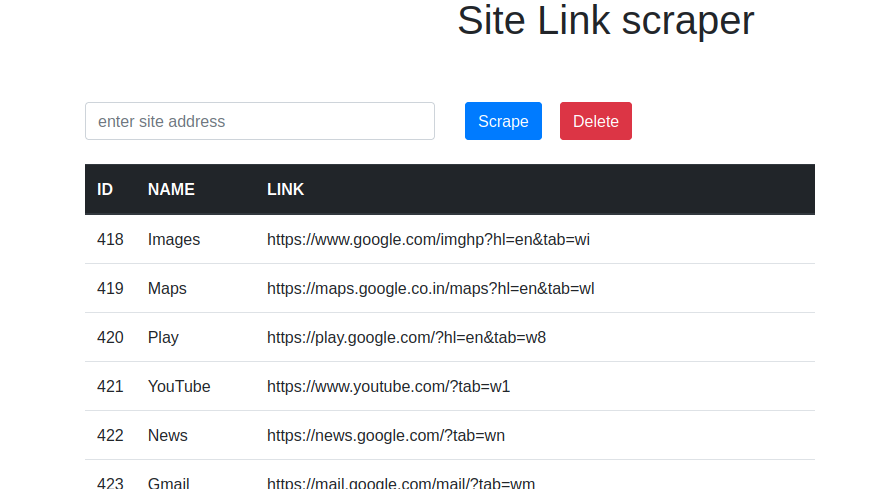

# Web Scraping Tool using Python, Django, and Beautiful Soup

This is a web scraping tool built using Python, Django, and Beautiful Soup. The tool takes a URL as input and extracts all the links available on the web page. It utilizes the power of Beautiful Soup, a popular Python library for web scraping, to parse HTML and extract the desired information.

## Features

#### - Takes a URL as input and extracts all the links from the web page.
#### - Utilizes the Django framework to create a user-friendly web interface for input.
#### - Employs Beautiful Soup for parsing HTML and extracting link elements.
#### - Provides a clear project structure for easy understanding and scalability.

## Prerequisites

#### - Python (>= 3.x)
#### - Django (>= 3.x)
#### - Beautiful Soup 4

## Installation

1. Clone this repository to your local machine:

```
   git clone https://github.com/abhishekgunkar1/Site-Scrapper.git
```


2. Navigate to the project directory:
```
cd Site-Scrapper
```

3. Install the required dependencies using pip:
```
pip3 install -r requirements.txt
```

4. Run the Django development server:
```
python3 manage.py runserver
```


